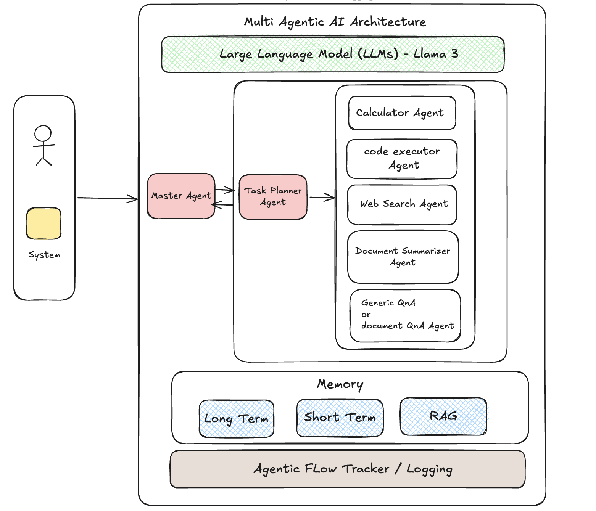

# AgenticFlow: Modular LangGraph Agent Orchestration

A modular AI agent platform built with LangGraph orchestration, powered by Groq's Llama 3. Features web search, code execution, calculations, document Q&A, robust memory (short-term, long-term, RAG), and a modern Gradio UI.

## Features

- **Full LangGraph Orchestration**: All agent workflows are managed by a LangGraph state machine for clarity and extensibility.
- **Strict Modular Agents**: Each tool (calculator, code, web search, summarizer, LLM) is a separate agent with clean interfaces.
- **Robust Memory**: Short-term, long-term, and RAG memory for context-aware math, Q&A, and follow-up reasoning.
- **Strict Q&A vs Summarization**: Planner and master agent ensure Q&A is routed to LLM (with RAG) and summaries only use the summarizer.
- **Modern Gradio UI**: File upload, chat bubbles, suggestions, and native file support.
- **Graph Export**: Export the full workflow as Mermaid, PNG, or ASCII for easy visualization.
- **Clean Logging**: Timestamped, event-based logs for high-level workflow auditing.

## Architecture (Multi Agent Framework)

Below is the actual framework for this system.



## Features

- **Task Planning**: LLM-driven planner breaks down complex queries into sequential steps.
- **Strict Tool Routing**: Q&A always uses LLM+RAG, summaries use summarizer only, code/math routed correctly.
- **Memory**: Short-term, long-term, and RAG for context, follow-up, and document Q&A.
- **Document Q&A**: Upload PDF/DOCX/TXT and ask questions; answers are strictly from the document.
- **Modern Gradio UI**: File upload, chat bubbles, suggestions, and session memory.
- **Clean Logging**: Timestamped, event-based logs (no queries/results) for workflow auditing.

## Setup Instructions

1. **Clone the repository:**
   ```bash
   git clone <repository-url>
   cd IntellectDesign
   ```
2. **Install dependencies:**
   ```bash
   pip install -r requirements.txt
   ```
3. **Set up environment variables:**
   ```bash
   export GROQ_API_KEY="your_groq_api_key"
   export TAVILY_API_KEY="your_tavily_api_key"
   ```
   You can also use a `.env` file for convenience.

## Usage

### Start the Application

```bash
python app/main.py
```

This launches the Gradio UI for chat, file upload, and agent orchestration.

### Example Queries
- **Multi-tool**: "Search for latest news about AI, then calculate 32+16 + abs(-12) * sqrt(3333)"
- **Code execution**: "Run this code: def factorial(n): ..."
- **Document Q&A**: "What analytics are present in the document?" (after uploading a file)
- **Summary**: "Summarize this document" (after uploading a file)

## Memory & RAG
- **Short-term**: Recent chat history for context.
- **Long-term**: Facts and results for follow-up math and reasoning.
- **RAG**: Uploaded documents are chunked and indexed for Q&A.

## Exporting the Workflow Graph

You can export the LangGraph workflow as Mermaid, PNG, or ASCII for documentation or visualization:

```bash
python app/agents/master_agent.py
```
- Outputs:
  - `langgraph_graph.mmd` (Mermaid diagram)
  - `langgraph_graph.txt` (ASCII diagram)
  - `langgraph_graph.png` (PNG image)

You can view the Mermaid file at [mermaid.live](https://mermaid.live) or open the PNG directly.

## Logging
- Logs are written to `logs/` with timestamps and high-level events only (init, input, step start/end, finish).
- No queries or results are logged for privacy and clarity.

## Development

- Add new agents by subclassing `BaseAgent` and registering in `MasterAgent`.
- Modify the workflow in `MasterAgent._build_graph()`.
- All agents are async and modular.

## License

This project is licensed under the MIT License - see the LICENSE file for details.

## Assumptions & Limitations

- **Document Summarization**: Currently optimized for short documents (e.g., 2-page PDFs). For large documents, chunking and hierarchical summarization (summarize chunks, then summarize those summaries) would be needed for accurate results.
- **Language Support**: Only English language is supported for queries, document Q&A, and summarization.
- **Code Execution**: Only Python code is supported for execution. No support for other languages or system-level commands.
- **Memory**: Short-term and long-term memory are session-based and not persisted across restarts unless explicitly implemented.
- **RAG (Retrieval-Augmented Generation)**: Only works with documents uploaded in the current session. No persistent or external document store.
- **File Types**: Document Q&A and summarization are tested with PDF, DOCX, and TXT files. Other formats may not be supported.

If you need to scale to larger documents, multi-language support, or persistent memory, further engineering is required. 
